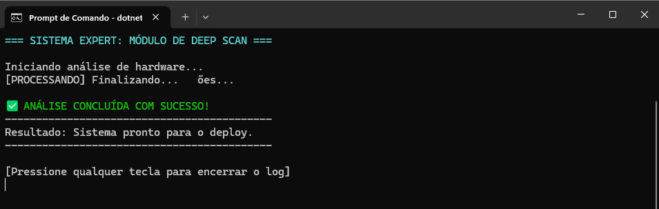

# 🚀 Simulação de Varredura de Sistema(1ª Heurista de Nielsen)

Nesta missão, implementei um simulador de varredura de sistema que utiliza essa heurística para evitar que o usuário ache que o programa "travou".

## 🛠️ Comandos de Construção Utilizados
- `dotnet new console`: Para criar a estrutura base do C#.
- `code .`: Para abrir o Visual Studio.
- `dotnet run`: Para ver a mágica acontecer.

## 📦 Estrutura Gerada
Arquivos que o .NET criou para mim:
1. `Program.cs`: Onde fica o código.
2. `ScannerExpert.csproj`: As configurações do meu projeto.

## 📸 Evidência de Execução

